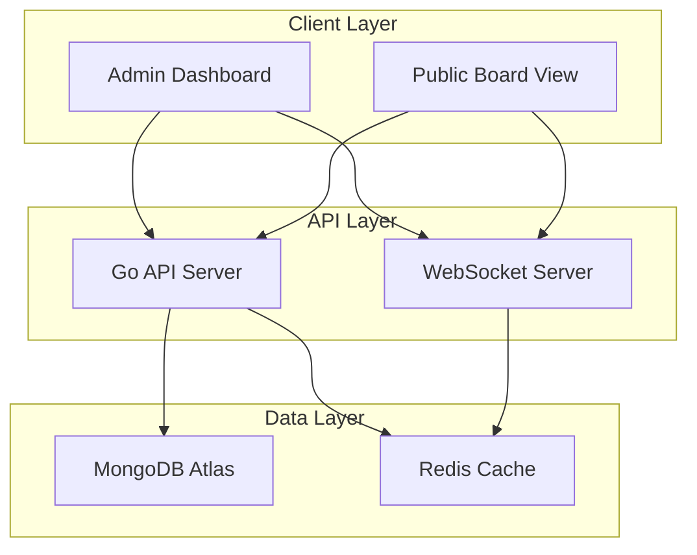

# Disko Design Document

## Overview

Disko is a web-based project management tool that allows solopreneurs to share their work progress with customers through public boards. The system features a dual-role architecture with Admin (solopreneur) and Public (customer) access levels, real-time feedback capabilities, and an intuitive drag-and-drop interface for managing ideas across different workflow stages.

## Architecture

### System Architecture

The application follows a modern web architecture pattern:

- **Frontend**: Single Page Application (SPA) using Go templating and JS
- **Backend**: RESTful API using Go backend
- **Database**: MongoDB Atlas with use of MongoDB 2.0 drivers (Go())
- **Real-time Communication**: WebSocket connections for live updates
- **Authentication**: JWT-based authentication for admin users leveraging Clerk Auth

### High-Level Architecture Diagram



## Components and Interfaces

### Frontend Components

#### Landing Page Components
- **LandingPage**: Main marketing page with hero, benefits, testimonials
- **HeroSection**: Product hero with value proposition
- **BenefitsSection**: Key benefits and features showcase
- **TestimonialsSection**: Customer testimonials and social proof
- **StatsCounter**: Incremental ticker showing total boards created
- **AuthButtons**: Sign-in and sign-up buttons with Clerk integration

#### Admin Components
- **AdminDashboard**: Main dashboard showing all boards
- **BoardEditor**: Interface for managing board settings and column visibility
- **IdeaManager**: Component for creating, editing, and managing ideas
- **DragDropBoard**: Interactive board with drag-and-drop functionality
- **RICEScoreEditor**: Component for managing RICE scoring

#### Public Components
- **PublicBoardView**: Read-only board view for customers
- **IdeaCard**: Display component for ideas with feedback options
- **FeedbackWidget**: Thumbs up and emoji feedback interface
- **SearchAndFilter**: Search and filtering functionality

#### Shared Components
- **IdeaCard**: Reusable component with different permission levels
- **SearchBar**: Master search functionality
- **ColumnView**: Configurable column display
- **ReleaseTable**: Tabular view for completed ideas
- **ThemeToggle**: Dark/light mode toggle component
- **ThemeProvider**: Context provider for theme state management

### API Endpoints

#### Board Management
```
GET    /api/boards              - Get all boards for admin
POST   /api/boards              - Create new board
PUT    /api/boards/:id          - Update board settings
DELETE /api/boards/:id          - Delete board
GET    /api/boards/:id/public   - Get public board view
```

#### Idea Management
```
GET    /api/boards/:id/ideas    - Get all ideas in board
POST   /api/boards/:id/ideas    - Create new idea
PUT    /api/ideas/:id           - Update idea
DELETE /api/ideas/:id           - Delete idea
PUT    /api/ideas/:id/position  - Update idea position/column
PUT    /api/ideas/:id/status    - Update idea status
```

#### Feedback System
```
POST   /api/ideas/:id/thumbsup  - Add thumbs up
POST   /api/ideas/:id/emoji     - Add emoji reaction
GET    /api/ideas/:id/feedback  - Get feedback summary
```

#### Search and Filter
```
GET    /api/boards/:id/search   - Search ideas within board
GET    /api/boards/:id/release  - Get released ideas with filters
```

#### Application Stats
```
GET    /api/stats/boards        - Get total board count for landing page ticker
```

## Data Models

### Board Model
```typescript
interface Board {
  id: string;
  name: string;
  description?: string;
  publicLink: string;
  adminId: string;
  visibleColumns: ColumnType[];
  visibleFields: IdeaField[];
  createdAt: Date;
  updatedAt: Date;
}
```

### Idea Model
```typescript
interface Idea {
  id: string;
  boardId: string;
  oneLiner: string;
  description: string;
  valueStatement: string;
  riceScore: RICEScore;
  column: ColumnType;
  position: number;
  inProgress: boolean;
  status: IdeaStatus;
  feedback: FeedbackSummary;
  createdAt: Date;
  updatedAt: Date;
}

interface RICEScore {
  reach: number;      // 0-100%
  impact: number;     // 0-100%
  confidence: number; // 1, 2, 4, 8 (hours, days, weeks, months)
  effort: number;     // 0-100%
}

type ColumnType = 'parking' | 'now' | 'next' | 'later' | 'release' | 'wont-do';
type IdeaStatus = 'draft' | 'active' | 'done' | 'archived';
type IdeaField = 'oneLiner' | 'description' | 'valueStatement' | 'riceScore';
```

### Feedback Model
```typescript
interface FeedbackSummary {
  thumbsUp: number;
  emojis: EmojiReaction[];
}

interface EmojiReaction {
  emoji: string;
  count: number;
}
```

### User Model
```typescript
interface User {
  id: string;
  email: string;
  name: string;
  role: 'admin';
  createdAt: Date;
}
```

## Database Schema

### MongoDB Collections Structure

```go
// Board collection document structure
type Board struct {
    ID             primitive.ObjectID `bson:"_id,omitempty" json:"id"`
    Name           string            `bson:"name" json:"name"`
    Description    string            `bson:"description,omitempty" json:"description"`
    PublicLink     string            `bson:"public_link" json:"publicLink"`
    AdminID        string            `bson:"admin_id" json:"adminId"` // Clerk user ID
    VisibleColumns []string          `bson:"visible_columns" json:"visibleColumns"`
    VisibleFields  []string          `bson:"visible_fields" json:"visibleFields"`
    CreatedAt      time.Time         `bson:"created_at" json:"createdAt"`
    UpdatedAt      time.Time         `bson:"updated_at" json:"updatedAt"`
}

// Idea collection document structure
type Idea struct {
    ID             primitive.ObjectID `bson:"_id,omitempty" json:"id"`
    BoardID        primitive.ObjectID `bson:"board_id" json:"boardId"`
    OneLiner       string            `bson:"one_liner" json:"oneLiner"`
    Description    string            `bson:"description" json:"description"`
    ValueStatement string            `bson:"value_statement" json:"valueStatement"`
    RiceScore      RICEScore         `bson:"rice_score" json:"riceScore"`
    Column         string            `bson:"column" json:"column"`
    Position       int               `bson:"position" json:"position"`
    InProgress     bool              `bson:"in_progress" json:"inProgress"`
    Status         string            `bson:"status" json:"status"`
    ThumbsUp       int               `bson:"thumbs_up" json:"thumbsUp"`
    EmojiReactions []EmojiReaction   `bson:"emoji_reactions" json:"emojiReactions"`
    CreatedAt      time.Time         `bson:"created_at" json:"createdAt"`
    UpdatedAt      time.Time         `bson:"updated_at" json:"updatedAt"`
}

type RICEScore struct {
    Reach      int `bson:"reach" json:"reach"`           // 0-100%
    Impact     int `bson:"impact" json:"impact"`         // 0-100%
    Confidence int `bson:"confidence" json:"confidence"` // 1, 2, 4, 8
    Effort     int `bson:"effort" json:"effort"`         // 0-100%
}

type EmojiReaction struct {
    Emoji string `bson:"emoji" json:"emoji"`
    Count int    `bson:"count" json:"count"`
}

// MongoDB Indexes
// boards collection:
// - { "admin_id": 1 }
// - { "public_link": 1 } (unique)

// ideas collection:
// - { "board_id": 1, "position": 1 }
// - { "board_id": 1, "column": 1 }
// - { "board_id": 1, "status": 1 }
```

## Error Handling

### Client-Side Error Handling
- **Network Errors**: Retry mechanism with exponential backoff
- **Validation Errors**: Real-time form validation with user-friendly messages
- **Permission Errors**: Redirect to appropriate access level
- **Not Found Errors**: Graceful fallback to board list or 404 page

### Server-Side Error Handling
- **Database Errors**: Transaction rollback and error logging
- **Validation Errors**: Structured error responses with field-specific messages
- **Authentication Errors**: Clear unauthorized responses
- **Rate Limiting**: Prevent abuse of public endpoints

### Error Response Format
```typescript
interface ErrorResponse {
  error: {
    code: string;
    message: string;
    details?: Record<string, string>;
  };
  timestamp: string;
  path: string;
}
```

## Real-Time Features

### WebSocket Events
- **idea:updated** - Broadcast idea changes to all board viewers
- **feedback:added** - Real-time feedback updates
- **board:updated** - Board configuration changes
- **idea:moved** - Drag and drop position updates

### Caching Strategy
- **Board Data**: Cache board configuration and idea lists in Redis
- **Public Links**: Cache public board access for faster loading
- **Search Results**: Cache frequent search queries
- **Feedback Counts**: Real-time counter updates

## Security Considerations

### Authentication & Authorization
- **Admin Authentication**: Clerk Auth integration with JWT validation
- **Public Access**: Rate-limited anonymous access to public boards
- **CORS Configuration**: Restrict origins for API access
- **Input Validation**: Sanitize all user inputs

### Data Protection
- **Public Link Security**: UUID-based links that are hard to guess
- **Admin Data Isolation**: Ensure admins can only access their own boards using Clerk user IDs
- **Feedback Anonymity**: No tracking of individual public user feedback
- **NoSQL Injection Prevention**: Proper input validation and MongoDB query sanitization

## Performance Optimizations

### Frontend Optimizations
- **Code Splitting**: Lazy load admin and public components separately
- **Virtual Scrolling**: Handle large numbers of ideas efficiently
- **Debounced Search**: Prevent excessive API calls during typing
- **Optimistic Updates**: Immediate UI feedback for drag operations
- **Theme Optimization**: CSS custom properties for efficient theme switching

### Backend Optimizations
- **Database Indexing**: Index on board_id, column_type, and position
- **Query Optimization**: Efficient joins and pagination
- **Caching Layer**: Redis for frequently accessed data
- **Connection Pooling**: Efficient database connection management

## Testing Strategy

### Unit Testing
- **Component Testing**: React components with Jest and React Testing Library
- **API Testing**: Express routes with supertest
- **Database Testing**: Model validation and query testing
- **Utility Testing**: RICE score calculations and validation functions

### Integration Testing
- **API Integration**: End-to-end API workflow testing
- **Database Integration**: Test database operations and constraints
- **WebSocket Testing**: Real-time feature testing
- **Authentication Flow**: Complete auth workflow testing

### End-to-End Testing
- **User Workflows**: Complete admin and public user journeys
- **Cross-Browser Testing**: Ensure compatibility across browsers
- **Mobile Responsiveness**: Test on various device sizes
- **Performance Testing**: Load testing for concurrent users

### Testing Tools
- **Frontend**: Jest, React Testing Library, Cypress
- **Backend**: Go testing package, Testify, Artillery (load testing)
- **Database**: MongoDB test containers with Go testing
- **E2E**: Playwright or Cypress