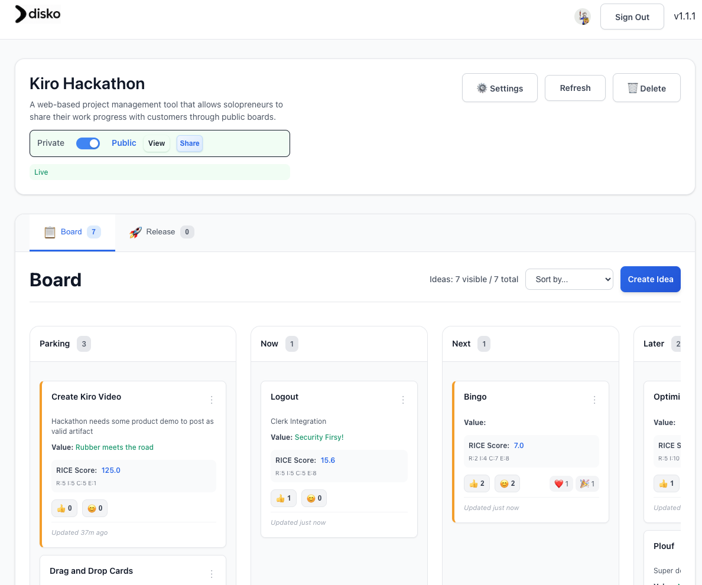
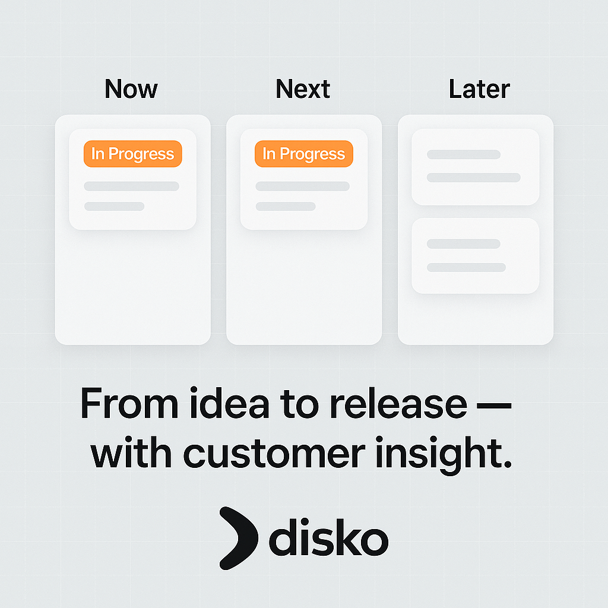

# Disko

A web-based project management tool that allows solopreneurs to share their work progress with customers through public boards.

## Screenshot



## Project Structure

```
disko/
├── main.go                # Main application entry point with route definitions
├── handlers/              # API handlers and business logic
├── models/                # Data models and database schemas
├── middleware/            # Custom middleware
├── utils/                 # Utility functions
├── templates/             # HTML templates
├── static/                # Static assets
│   ├── css/               # Stylesheets
│   ├── js/                # JavaScript modules
│   ├── images/            # Images and logos
│   └── .version           # Application version file
├── docs/                  # Documentation
├── env.example            # Environment variables template
├── go.mod                 # Go module dependencies
├── go.sum                 # Dependency checksums
├── LICENSE                # GNU General Public License v3.0
└── README.md              # This file
```

## Social Posts




## Tech Stack

### Backend
- **Go 1.22.0** with Gin framework for HTTP server
- **MongoDB 2.0 driver** for database operations
- **Clerk SDK** for authentication and user management
- **WebSocket** support for real-time updates
- **SMTP email** integration for board invitations
- **Rate limiting** for public board access

### Frontend
- **Vanilla JavaScript** with modular architecture
- **HTML templates** rendered server-side with Go
- **CSS** for responsive design and styling
- **WebSocket** for real-time board updates
- **Drag and drop** functionality for idea management

### Key Features

#### Core Functionality
- **Board Management**: Create, edit, and delete boards
- **Idea Management**: Add, edit, and organize ideas with drag-and-drop
- **RICE Scoring**: Prioritize ideas using Reach, Impact, Confidence, and Effort metrics
- **Public Sharing**: Publish boards for public viewing with secure links
- **Real-time Updates**: Live synchronization across multiple users

#### Collaboration Features
- **Email Invitations**: Send beautiful HTML emails to share boards
- **Feedback System**: Thumbs up and emoji reactions on ideas
- **Public Boards**: Read-only access for stakeholders
- **Board Settings**: Customize column visibility and field display

#### User Experience
- **Responsive Design**: Works seamlessly on desktop and mobile
- **Search Functionality**: Find ideas quickly across boards
- **Release Table**: Track completed ideas and milestones
- **Board Statistics**: View engagement metrics and activity

## Getting Started

### Prerequisites
- Go 1.22.0 or higher
- MongoDB Atlas account
- Clerk account for authentication
- SMTP server for email

### Setup

1. **Clone the repository**
   ```bash
   git clone <repository-url>
   cd disko
   ```

2. **Install dependencies**
   ```bash
   go mod download
   ```

3. **Configure environment variables**
   ```bash
   cp env.example .env
   # Edit .env with your configuration
   ```

4. **Start the application**
   ```bash
   go run main.go
   ```

5. **Access the application**
   - Visit http://localhost:8080
   - Sign up/in with Clerk authentication
   - Create your first board

## Environment Variables

### Required Configuration
```bash
# Database
MONGODB_URI=mongodb://localhost:27017/disko
# Optional explicit DB name (defaults to "disko" if unset)
# MONGODB_DATABASE=disko

# Clerk Authentication
CLERK_SECRET_KEY=your_clerk_secret_key
CLERK_PUBLISHABLE_KEY=your_clerk_publishable_key
CLERK_FRONTEND_API_URL=https://your-clerk-frontend-api.clerk.accounts.dev

# Server
PORT=8080
```

### Optional Configuration
```bash
# Email (for board invitations)
SMTP_HOST=smtp.gmail.com
SMTP_PORT=587
SMTP_USER=your-email@gmail.com
SMTP_PASS=your-app-password
FROM_EMAIL=your-email@gmail.com
# Optional From name (used by contact form notifications)
FROM_NAME=Disko
APP_URL=http://localhost:8080

# Rate Limiting
RATE_LIMIT_PUBLIC_BOARD_SECONDS=30
RATE_LIMIT_THUMBSUP_SECONDS=10
RATE_LIMIT_EMOJI_SECONDS=5

# Notifications (optional)
# Enable/disable channels for feedback notifications
EMAIL_ENABLED=false
SLACK_WEBHOOK_URL=
WEBHOOK_URL=
```

## Routes and Endpoints

### Web (public) routes
- `GET /` - Landing page (shows aggregate stats and app version)
- `GET /about` - About page
- `GET /contact` - Contact page
- `GET /terms` - Terms of service
- `GET /privacy` - Privacy policy
- `GET /robots.txt` - SEO robots file
- `GET /sitemap.xml` - SEO sitemap
- `GET /public/:publicLink` - Public board view
- `GET /dashboard` - Admin dashboard (rendered; auth handled on the frontend)
- `GET /board/:id` - Admin board view (rendered; auth handled on the frontend)

### API (public) endpoints
- `GET /api/ping` - Health check
- `POST /api/contact` - Submit contact form (rate limited: 1/hr per IP)
- `GET /api/boards/:id/public` - Get public board by public link
- `GET /api/boards/:id/ideas/public` - Get public ideas for a board (respects visibility)
- `GET /api/boards/:id/release/public` - Get public released ideas
- `GET /api/ws/boards/:boardId` - WebSocket connection for real-time updates

### API (authenticated) endpoints
- `GET /api/user` - Get authenticated user info
- `GET /api/protected` - Test protected endpoint

- Boards
  - `POST /api/boards` - Create board
  - `GET /api/boards` - List boards
  - `GET /api/boards/:id` - Get board details
  - `PUT /api/boards/:id` - Update board (toggle public, visible columns/fields)
  - `DELETE /api/boards/:id` - Delete board (cascades ideas)
  - `POST /api/boards/:id/invite` - Send board invitation email (requires board to be public)
  - `GET /api/boards/:id/ideas` - Get all ideas for a board
  - `GET /api/boards/:id/search` - Search ideas with filters and sorting
  - `GET /api/boards/:id/release` - Paginated released ideas

- Ideas
  - `POST /api/boards/:id/ideas` - Create idea on a board
  - `PUT /api/ideas/:id` - Update idea
  - `PUT /api/ideas/:id/position` - Update idea column and position
  - `PUT /api/ideas/:id/status` - Update idea status and auto-move columns
  - `DELETE /api/ideas/:id` - Delete idea

### Rate limiting
- Public board page access: `RATE_LIMIT_PUBLIC_BOARD_SECONDS` (default 30s per IP)
- Public thumbs up: `RATE_LIMIT_THUMBSUP_SECONDS` (default 10s per IP)
- Public emoji reaction: `RATE_LIMIT_EMOJI_SECONDS` (default 5s per IP)
- Contact form: 1 submission per hour per IP

## RICE Scoring System

Disko implements the RICE scoring framework for idea prioritization:

- **Reach**: How many people will this impact? (0-10 scale)
- **Impact**: How much will this impact each person? (0-10 scale)
- **Confidence**: How confident are we in our estimates? (0-10 scale)
- **Effort**: How much work will this take? (1, 3, 8, or 21 points)

RICE Score = (Reach × Impact × Confidence) ÷ Effort

## Email Setup

To enable board invitation emails:

1. **Gmail Setup**
   - Enable 2-factor authentication
   - Generate an App Password
   - Use the app password as `SMTP_PASS`

2. **Environment Variables**
   ```bash
   SMTP_HOST=smtp.gmail.com
   SMTP_PORT=587
   SMTP_USER=your-email@gmail.com
   SMTP_PASS=your-app-password
   FROM_EMAIL=your-email@gmail.com
   APP_URL=http://localhost:8080
   ```

**Note**: Board invitation emails are sent TO the email address entered in the invitation form. The email is sent FROM the configured `FROM_EMAIL` address.

## Versioning

- The application reads its version from `static/.version` and renders it in templates.
- Update this file to bump the version shown in the UI.

## Development

### Project Structure
The application follows a clean architecture pattern:
- **Handlers**: Business logic and API endpoints
- **Models**: Data structures and database operations
- **Middleware**: Authentication and request processing
- **Utils**: Shared utilities and services
- **Templates**: Server-side HTML rendering
- **Static**: Client-side assets and JavaScript

### Key Components
- **DragDropBoard**: Main board interface with drag-and-drop
- **IdeaManager**: Idea creation and editing functionality
- **WebSocketManager**: Real-time updates and synchronization
- **EmailService**: Board invitation and notification emails
- **AuthMiddleware**: Clerk authentication integration

## License

This project is licensed under the GNU General Public License v3.0. See the [LICENSE](LICENSE) file for details.

## Changelog

### [v1.1.3] - Remove top search UI
- **🧹 UI Simplification**: Removed master search bar from board pages and public view to streamline the interface and reduce unauthenticated 401 errors.
- **🧩 Cleanup**: Dropped `search-bar.js` from templates and disabled its initialization in `static/js/board.js`.

### [v1.1.2] - Docs and Routes Alignment
- **📝 Docs**: Updated README with accurate routes (public, API, authenticated), rate limits, and environment variables (`MONGODB_DATABASE`, `FROM_NAME`, `EMAIL_ENABLED`, `SLACK_WEBHOOK_URL`, `WEBHOOK_URL`).
- **🔎 SEO**: Documented `GET /robots.txt` and `GET /sitemap.xml` routes.
- **⚡ Realtime**: Clarified WebSocket endpoint `GET /api/ws/boards/:boardId`.
- **📦 Versioning**: Noted usage of `static/.version` in templates.

### [v1.1.1] - Create Idea Overlay Fix
- **🐛 Bug Fix**: Restored the Create Idea overlay by re-binding board event listeners after authentication updates the admin state.
- **⚙️ Stability**: Ensures admin-only actions (Create Idea, Settings) initialize reliably post-auth.

### [v1.0.12] - Email Invitation Fix
- **🐛 Bug Fix**: Fixed duplicate email sending issue in board invitations
- **🔧 Event Listeners**: Improved event listener management to prevent duplicates
- **📧 Email**: Board invitations now send only once per form submission
- **🎯 User Experience**: Eliminated confusion from receiving duplicate emails
- **🔒 Form Protection**: Added submit button disabling to prevent multiple submissions

### [v1.0.11] - GNU License Addition
- **📄 License**: Added GNU General Public License v3.0 to the repository
- **🔒 Open Source**: Ensures the project remains open source and free
- **📋 Legal Protection**: Provides legal framework for sharing and modification
- **🌐 Community**: Enables community contributions and derivative works

### [v1.0.10] - Previous Features
- **🎯 RICE Scoring**: 0-10 scale for idea prioritization
- **📧 Email Invitations**: Beautiful HTML emails for board sharing
- **🌐 Public Boards**: Secure public sharing with rate limiting
- **🔄 Real-time Updates**: WebSocket-powered live synchronization
- **📱 Responsive Design**: Mobile-friendly interface
- **🔍 Search Functionality**: Find ideas across boards
- **📊 Board Statistics**: Engagement metrics and activity tracking
- **🎨 Drag & Drop**: Intuitive idea organization
- **🔒 Authentication**: Clerk-powered user management
- **📋 Release Table**: Track completed ideas and milestones

## Contributing

1. Fork the repository
2. Create a feature branch
3. Make your changes
4. Add tests if applicable
5. Submit a pull request

## Support

For support, please contact us through the [contact page](http://localhost:8080/contact) or create an issue in the repository.

---

**Disko** - Empowering solopreneurs to share their progress with customers through beautiful, collaborative project boards.